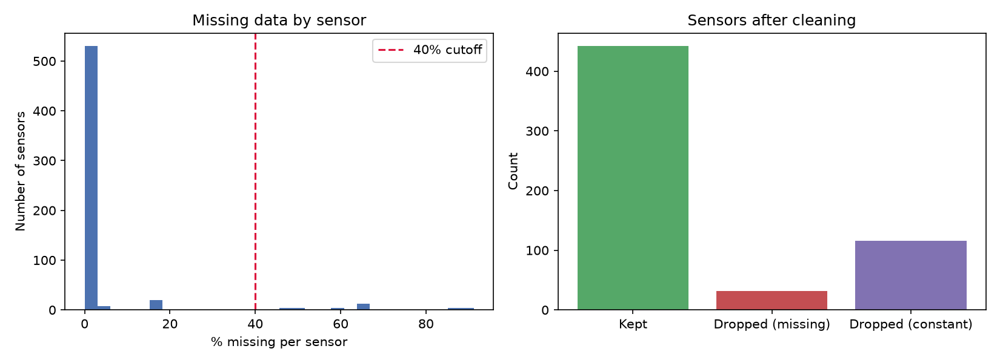
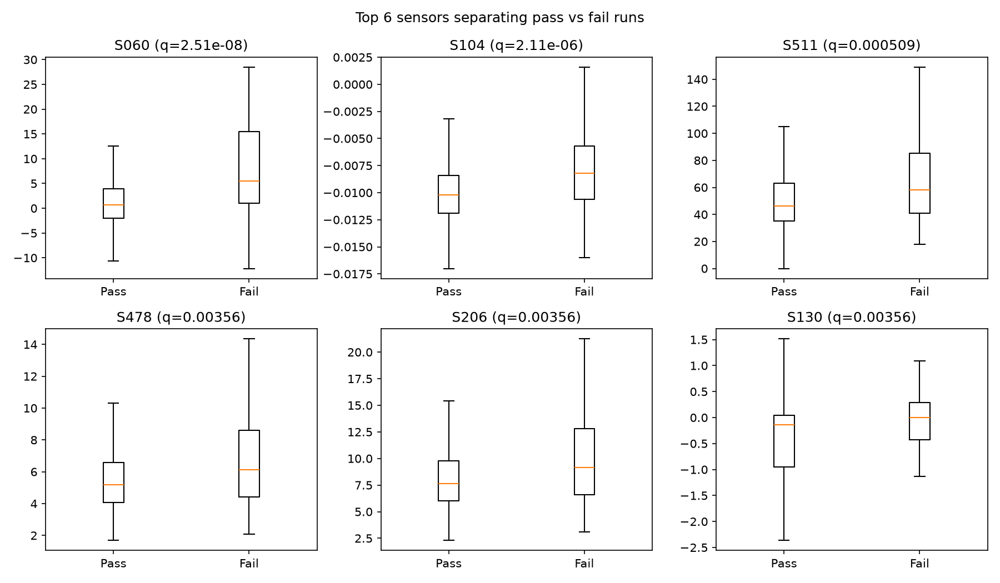
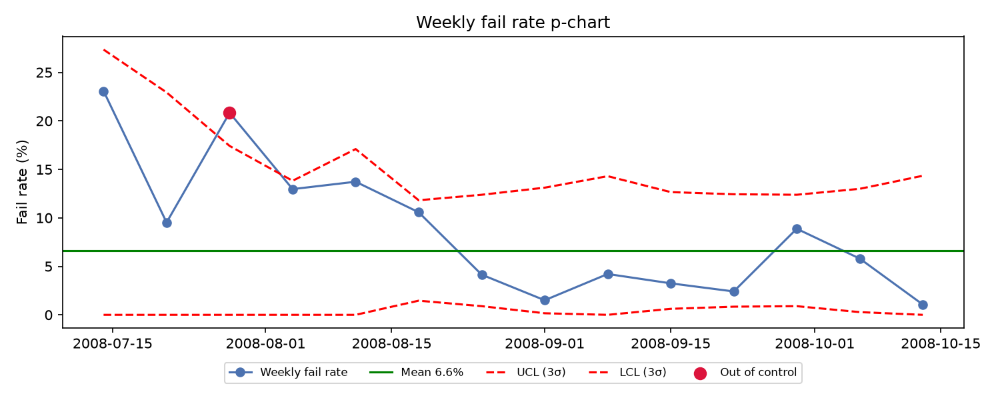
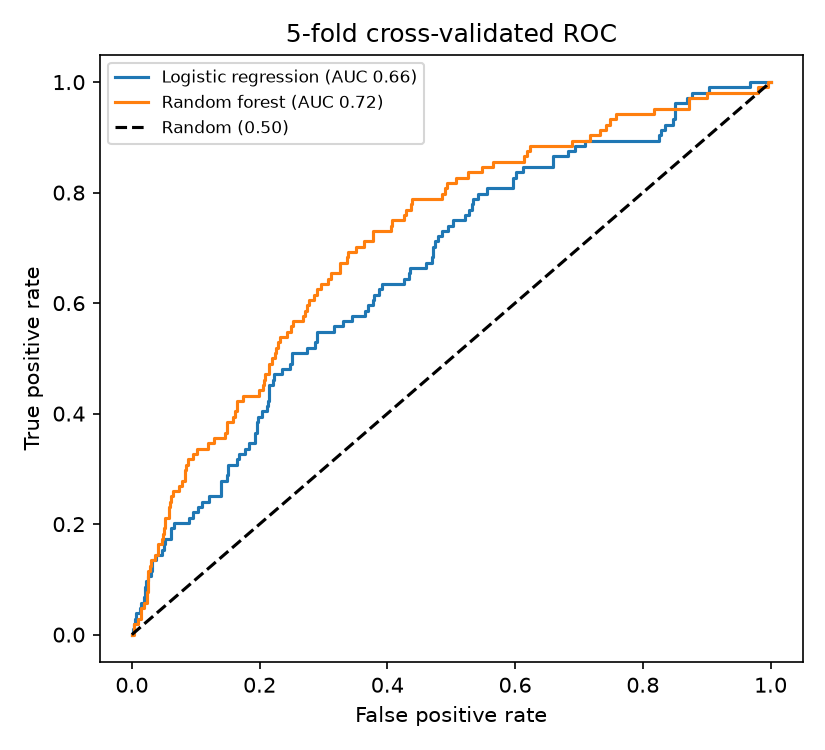

# Semiconductor Yield Analysis

Exploratory analysis of semiconductor manufacturing sensor data using the
UCI SECOM dataset.

The project investigates whether manufacturing sensor measurements can be
used to identify patterns associated with failed production runs and monitor
changes in manufacturing yield.

## Dataset

The UCI SECOM dataset contains:

- 1,567 semiconductor production runs
- 590 anonymised sensor variables
- 104 failed runs
- 1,463 passing runs
- Overall yield of 93.4%

Dataset source:
https://archive.ics.uci.edu/dataset/179/secom

## Analysis

The analysis was performed in Python using Pandas, NumPy, SciPy,
Scikit-learn and Matplotlib.

The workflow included:

1. Cleaning sensors with excessive missing data or no variation.
2. Comparing sensor measurements between passing and failing runs.
3. Applying Mann-Whitney U tests with Benjamini-Hochberg multiple-testing correction.
4. Monitoring weekly failure rates using a statistical process control p-chart.
5. Evaluating failure prediction using 5-fold cross-validation.
6. Comparing Logistic Regression and Random Forest models.

## Key Results

- Reduced 590 raw sensor variables to 442 usable variables after data cleaning.
- Identified 17 sensor variables significantly associated with failed runs after multiple-testing correction.
- Top statistical candidates included S060, S104 and S511.
- Detected 1 of 14 production weeks outside the 3-sigma process control limits.
- Logistic Regression achieved a cross-validated ROC-AUC of 0.66.
- Random Forest achieved a cross-validated ROC-AUC of 0.72.

The statistical associations identify candidate sensor signals for further
engineering investigation and should not be interpreted as confirmed
root causes of failure.

## Visualizations

### Sensor Data Cleaning



### Sensors Associated with Failure



### Weekly Failure Rate



### Failure Prediction



## Technologies

- Python
- Pandas
- NumPy
- SciPy
- Scikit-learn
- Matplotlib
- Statistical Process Control
- Machine Learning

## Running the Analysis

Download `secom.data` and `secom_labels.data` from the
[UCI SECOM dataset](https://archive.ics.uci.edu/dataset/179/secom) and place
them in the same directory as `secom_analysis.py`.

Install the required Python packages:

```bash
pip install pandas numpy scipy scikit-learn matplotlib
